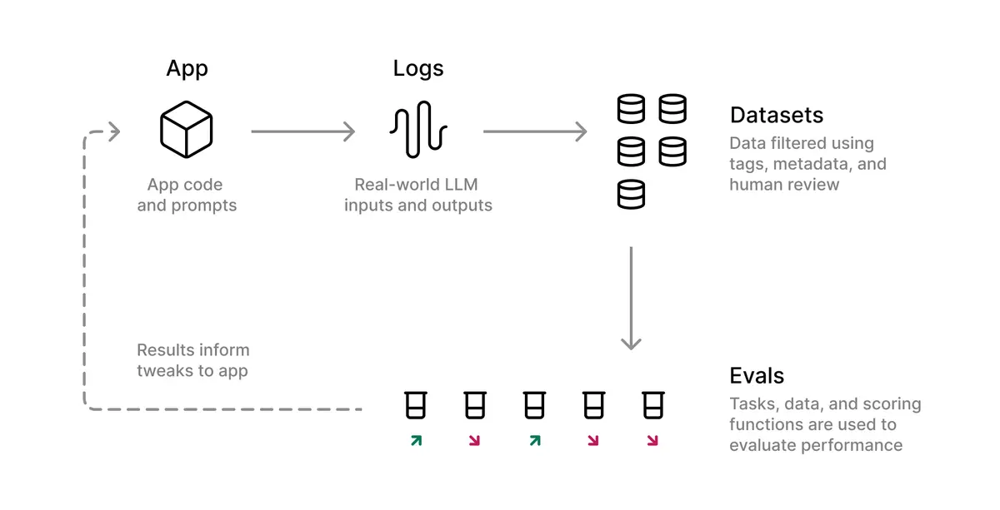

Building AI agents is **hard**. Most attempts end up with brittle systems that break in production, cost too much to run, or worse - make costly mistakes that could have been prevented.

Fortunately, there are several core principles that I've learned while building agents at [Zapier](https://zapier.com) and [Vendr](https://vendr.com) that actually work.

---

## What's an "AI Agent"?

Before we dive into the principles, let's start with a concrete example of what an AI agent actually is because with all the hype, it's hard to cut through the noise.

Here's the key distinction: a regular AI is like a _single-track railway - input goes in, output comes out along a fixed path_. An AI Agent is more like a driver who can navigate different routes, check conditions, and adjust the journey as needed. And doing so in a loop until task is done.


Let's see this in action:

Input: "Find the warmest EU capital today and email me about it"

Here's how an Agent thinks and acts:

```
1. First thought: "I need to be strategic about this. Let's focus on southern capitals that are typically warmest"
   - Generates candidates: Madrid, Athens, Rome
   - This will be more efficient than checking all 27 capitals
2. Gathers Data:
   - Makes Weather API call for Madrid ➜ 18°C
   - Makes Weather API call for Athens ➜ 16°C
   - Makes Weather API call for Rome ➜ 15°C
3. Analyzes Results:
   - "Madrid is warmest at 18°C"
4. Takes Action:
   - Composes informative email about Madrid's weather
   - Uses Gmail API to send the message
   - Verifies email delivery and exits the loop providing final answer
```

As you can imagine, this is a multi-step process and in these steps, each one can fail in different ways. It is crucial to design safeguards and feedback loops to ensure the agent can recover from failures and continue to deliver value.

## Core Principles for Building Effective AI Agents

### 1. Implement Feedback Loops

The foundation of any effective AI agent is a robust feedback loop. Whenever things go wrong, the agent should be able to learn from the error and adjust its behavior.

An example here is calling an API. If the API call fails, the agent should take the error response, feed it back into the context and try again having learned from the error.

```ts
// Pseudocode
const { toolCall, finalResponse } = await agent.run(state);
while (!finalResponse) {
	const toolCallResponse = await toolCall.execute();
	if (!toolCallResponse.ok) {
		state.messages.push(`I need to retry. API call failed: ${toolCallResponse.error}`);
	}
}
```

Another example: ad-hoc code generation & execution.

My suggestion here is to use compiled languages (Typescript) over interpreted ones (Python) - they provide immediate feedback through compiler errors and warnings before runtime, preventing potential issues before they occur. This is crucial for side-effecting operations like API calls, file uploads, etc. With interpreted languages, you risk transitioning to a broken state if an error occurs in the middle of a multi-step process.

```typescript
const twitterApi = { tweet: async (msg: string) => {} };
const discordApi = { send: async (msg: string) => {} };

const crossPostAnnouncement = async (message: string) => {
	// First API succeeds - tweet is live
	const tweetId = await twitterApi.tweet(message);

	// Second API fails - there's no sendMessage method
	// This gets caught by the compiler, code is rewritten
	// to use the correct method name and ran afterwards
	await discordApi.sendMessage(`${message} (Twitter: ${tweetId})`);
};

crossPostAnnouncement("Launch day!");
```

Where as in interpreted language:

```python
twitter_api = { "tweet": lambda x: None }
discord_api = { "send": lambda x: None }

def cross_post_announcement(message, twitter_api, discord_api):
    # This succeeds, tweet goes live
    tweet_id = twitter_api.tweet(message)

    # This fails because there's no send_message method, only "send"
    # The error is only detected at runtime after the tweet is live
    # In the next loop iteration, the agent will try to send the message again
    # To both Twitter and Discord creating duplicate tweets
    discord_api.send_message(f"{message} (Twitter: {tweet_id})")

cross_post_announcement("Launch day!")
```

If you're planning to use arbitrary code execution, pay special attention to the security implications - you runtime should be sandboxed and isolated from the rest of the system either by using [E2B](https://e2b.dev/), [Firecracker](https://firecracker.dev/) or AWS Lambda with minimal permissions.

### 2. Separate Planning from Execution

One of the biggest challenges with AI agents is managing complex state workflows. Research shows that LLMs perform best when focused on a single task at a time. When handling multi-step processes, an LLM's context can get polluted with execution details, leading to [Catastrophic Forgetting](https://arxiv.org/abs/2308.08747), especially when dealing with smaller models.

Split your agent's operation into two distinct phases:

- Planning: A high-level agent that:

  - Breaks down complex tasks into smaller steps
  - Creates an execution strategy
  - Remains unaware of implementation details

- Execution: A separate agent that:
  - Follows the plan step by step
  - Handles specific implementation details
  - Doesn't need to understand the overall goal
  - Can be executed per step so each step can be evaluated independently

This separation prevents context pollution (imagine executor dealing with huge API responses or repeated errors) and keeps each component focused on its specific role. For example:

```typescript
interface Plan {
	steps: Array<{
		action: string;
		params: Record<string, any>;
	}>;
}

// Planner focuses on strategy
// Only knows about the plan and the current plan progress
// As reported by the executor(s)
const planner = new Agent({
	role: "Create a step-by-step plan without execution details",
});

// Executor focuses on implementation.
// It's context can be polluted with lots of details
const executor = new Agent({
	role: "Execute individual steps without knowledge of overall goal",
});

const plan = await planner.createPlan(task);
for (const step of plan.steps) {
	const result = await executor.executeStep(step, state);
	state.trace.push(result.message);
}
```

This approach significantly improves reliability and makes the system more maintainable.

It also has several benefits:

- Instead of having one big e2e eval, you can easily monitor & eval smaller parts of the system and iterate on them independently like in unit tests
- Failures in tools are isolated to the executor and aren't forcing you to rewrite the plan and star over the whole flow
- Allows for using different models based on the task complexity - smaller, more cost-effective models can handle trivial execution steps while keeping the expensive, powerful models for high-level planning

### 3. Leverage Plan Reusability

Don't reinvent the wheel for similar requests. Most agent tasks are repetitive by nature - think data processing, content generation, or API interactions. The only thing that differs is the actual values that are flowing through the system. Having your LLM regenerate plans for similar tasks is:

- Wasteful of compute resources
- Potentially risky due to LLMs' probabilistic nature
- Slower & more expensive than reusing proven plans

Instead, implement a semantic caching system for planner:

```typescript
interface CachedPlan {
	embedding: number[];
	plan: Plan;
	goal: string;
}

const semanticPlanCache = {
	async findSimilar(goal: string) {
		const goalEmbedding = await embed(goal);
		// Find the most similar goal in the cache
		return vectorDb.query(goalEmbedding, { threshold: 0.95 })[0];
	},

	async store(plan: Plan) {
		await vectorDb.insert({
			embedding: await embed(goal),
			plan,
		});
	},
};

const agent = {
	async planTask(userQuery: string) {
		const proposedPlan = await llm.createPlan(userQuery);
		const cached = await semanticPlanCache.findSimilar(proposedPlan);
		if (cached) return cached.plan;

		await planCache.store(proposedPlan);
		return proposedPlan;
	},
};
```

This approach:

- Uses embeddings to find semantically similar plans
- Reuses proven plans instead of regenerating them
- Reduces latency and compute costs
- Improves reliability by using verified solutions

However, that comes with a several risks:

- The ideal desired plan varies from the one that was cached in a very subtle way but leads to a different outcome
- The context of the cached plan is polluted with details (e.g. IDs or variables) that are not relevant to the new goal
- The stored plan might be even incorrect. This can be mitigated by gathering user's feedback and the outcome of the plan and flagging it accordingly

If that's a risk you're not willing to take, you can serve as few-shot examples when generating new plans to reinforce good behavior:

```ts
const systemPrompt = `
You are a planner agent. Your job is to create a plan for the user query.

User query: ${query}

Plans that worked in the past:
${await db.getSuccessfulPlans(query)}`;
```

Similar example of "skill acquisition" is the [Voyager agent](https://arxiv.org/abs/2305.16291) that was able to learn and accumulate skills over time.

### 4. Incorporate Human Oversight

AI agents often interact with real-world systems and even cause side-effects in real life, e.g. support bot issuing refunds. Depending on the nature of the agent, you might want to implement "Human in the Loop" for:

- Destructive actions (e.g. deleting data)
- Operations with significant consequences (large refunds, important emails, etc.)
- Complex decision-making processes - let humans provide confirmation or denial before critical actions are executed. You may even allow for human to intervene and correct the agent's behavior.

As you build up a dataset of successful and failed interactions between you and your agent, you can your own LLM-as-a-judge to gradually delegate more and more of the decision-making process to the agent.

There's an excellent guide on aligning LLM-Evaluators to your criteria by [Eugene Yan - Evaluating the Effectiveness of LLM-Evaluators](https://eugeneyan.com/writing/llm-evaluators/#aligning-llm-evaluators-to-our-criteria)

### 5. Embrace Specialized Sub-agents

Rather than creating a jack-of-all-trades agent with monstrous prompt and with numerous tools, break down functionality into specialized sub-agents:

- Coding agents
- Financial agents
- Querying agents
- Task-specific agents

Why? Each tool is lengthy `JSONSchema` that is passed as a system prompt to the LLM. It costs money, it hurts the performance and can be hard to tune. It will have much higher chance of success if finance-related question is handled by a finance agent instead of a general-purpose one that is polluted with a lot of irrelevant tools.

Modular approach simplifies the system. Like in the planner-executor division each of the subagents have an independent, task-specific prompt which makes it easier to tune each piece independently without touching the rest of the system. Once again, instead of having one huge e2e eval, you can easily monitor & eval smaller parts of the system and iterate on them independently like in unit tests.

### 6. Implement Strong Guardrails

Use robust validation tools at every step:

- Strict input/output validation, especially for tool calls: Python with [Instructor](https://python.useinstructor.com/) or Pydantic, TypeScript with Zod (with is built-in into brilliant [`ai`](https://www.npmjs.com/package/ai) library). These guardrails prevent agents from straying outside their intended parameters and ensure reliable operation.
- Limit the number of iterations and retries aka budget: If an agent is stuck in a loop, it's a good idea to limit the number of iterations to prevent infinite loops. Additionally, your agent shouldn't be able to call an API endpoint more than a few times or used as a DDoS vehicle.
- Use a timeout for each step: If an agent is taking too long to complete a step, it's a good idea to timeout the step and move on to the next one.
- Use [OpenAI's Moderation API](https://platform.openai.com/docs/guides/moderation/quickstart) to check both inputs and outputs of the agent for harmful content. This API is free to use and can prevent your agent from saying harmful things under your brand's name. The process of checking the input should be parallelized with the execution of the agent so it doesn't slow down the main execution loop.

### 7. Observability & monitoring.

Instrumentation is a must. And I'm not speaking about logging. You're going to get lost in a sea of logs and it's not going to help you. Instead, instrument your system with proper tools like [Braintrust](https://www.braintrust.com/), [Langfuse](https://langfuse.com/), [Langsmith](https://smith.langchain.com/) or [Humanloop](https://humanloop.com/).


> Example trace of Zapier Agent

All of these tools will help you understand what your agent is doing (Tracing), how it's doing it (Scorers / Online Evaluators), how it's being used by your users (Surprise! Chances are that the use cases are going to be different than what you expected) and what's the outcome of its operation (Metrics).

Gather user feedback on the outcome of the agent's operation and flag it as correct or incorrect. This will help you understand if the agent is working as expected and build a dataset of successful and failed operations necessary for evals. They will be essential for making prompt changes and improving the agent's behavior.



> Evals in AI Development Workflow (stolen from Braintrust's Docs)

### 8. Evals

<details>
  <summary>Evals? What's that?</summary>

> Evals are a way to evaluate the agent's behavior and make sure it's working as expected. A dry run. Think of tests but because of the probabilistic nature of LLMs, you need to run them a lot more times to get a sense of the system's behavior.
> And you probably need a custom tool to grade the output, because often time it's unstructured so you cannot use classical assertions like `==` or `>`. Instead, you can compare the "Factuality" of the output to the expected outcome by leveraging other LLM or use "Semantic Similarity" to compare the output to the expected outcome based on the embedding distance between expected and actual output.

</details>

I would argue that evals in an AI system are even more important than tests in classical software engineering. In non-AI systems, there's often a finite number of behaviors that the system can exhibit. You can easily identify edge cases like negative numbers, invalid dates, empty strings, etc.

With AI systems, there's an long tail of cases that can occur in the latent space - prompt injections, identity manipulation, complex queries, malformed input, malicious intents, bad prompting, the list goes on, not to mention that your system might simply fail to achieve the goal. The probability of failing to complete the task grows exponentially with the complexity of the system and the number of steps in the agent's operation.

If `P(single_step_success)` = 0.95 (Quite high, right?), then for a chain of 10 steps where each step must succeed is `P(success) = 0.95^10 = 0.598`. Quite low, right?


That's why tuning your system is at the smallest part of the chain is so important. If you followed the previous principles, you should have a system that is easy to evaluate and tune.

### 9. Security

There are more vectors of attack than in classical API. Your agent is not only going to be able to access your data but also execute code and make side-effects in your system. Possible combination of inputs is endless. Your system is never going to be 100% secure, but you can make it harder for the attacker to succeed.

#### Authentication & Authorization

Don't give your agent wildcard access to your system, that is a recipe for disaster. New jailbreaking techniques are being developed every day and it's only a matter of time before malicious actor will be able to exploit your agent, either by impersonating other users or accessing unauthorized data.

Instead, rely on the already existing authentication and authorization mechanisms. For instance, if your agent needs to be able to fetch users data, it should use the existing API make calls on users behalf using their identity to fetch the data. That will not only prevent the agent from accessing unauthorized data (cross-tenant leaks) but also make the behavior space more bounded and predictable (using available API calls instead of crafting SQL queries).

#### Sanitization

Prompt injection is not the only problem here. You can use tools like [llm-guard](https://llm-guard.com/) to sanitize the input of the agent and prevent it from common prompt injection techniques.

Another category of problems are e.g.:

- Comparing your product / brand to a competition
- Forcing your agent assist you in tasks that are not in its scope
- Manipulating the agent to reveal implementation details or system architecture
- Using the agent as a proxy for automated spam or abuse

You system should be able to detect these patterns and reject them.

## Conclusion

Building effective AI agents requires careful attention to these core principles. By implementing feedback loops, separating concerns, and maintaining strict guardrails, we can create agents that are both powerful and reliable. Remember: the goal isn't to create the most feature-rich agent, but rather to build one that consistently delivers value within its defined scope.

Remember to test thoroughly and start small - you can always expand an agent's capabilities over time as you verify its reliability in production environments.
