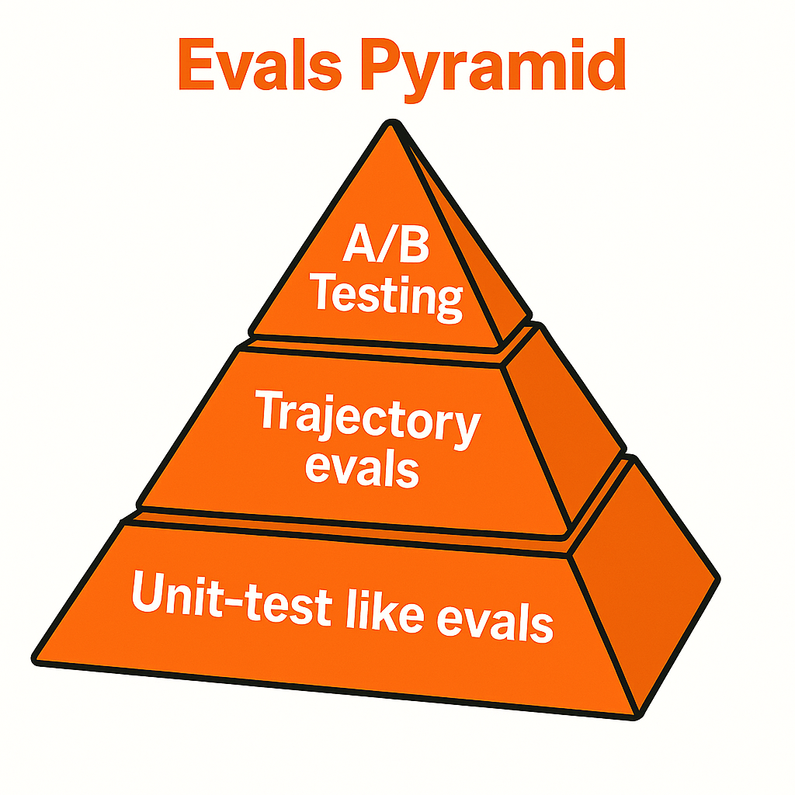

> The following blogpost is co-created with my dear friend [@vitorbal](https://x.com/vitorbal). We presented this blogpost as a part of AI Engineer World's Fair 2025. You can watch it below:

<iframe
	width="560"
	height="315"
	src="https://www.youtube.com/embed/Vqsfn9rWXR8?start=1820"
	title="YouTube video player"
	frameBorder="0"
	allow="accelerometer; autoplay; clipboard-write; encrypted-media; gyroscope; picture-in-picture"
	allowFullScreen
></iframe>

Building good AI agents is hard. Building evaluations for them? Even harder.

Most companies are doing it backwards: prototype → vibes-based flashy demo → ship to users → profit 💸. Spoiler alert: this fails spectacularly in production.

The real secret isn't avoiding failures. It's gathering data from every failure, understanding what went wrong, and systematically adapting your models and parameters so you start getting better. After shipping AI agents to millions of Zapier users and collecting thousands of pieces of feedback, we've learned that you need a structured approach to turn chaos into signal.

## The Evals Pyramid

Just like the testing pyramid in traditional software development (unit tests at the base, integration tests in the middle, E2E tests at the top), AI agent evaluations need a similar hierarchy. Each layer serves a different purpose and operates at a different speed and cost.



Think of it as **impact vs. difficulty vs. confidence**. The base is fast and high-volume but limited in scope. The peak is slow and expensive but captures real user satisfaction. Each layer complements the others, and you can't skip straight to the top.

## Unit-Test Like Evals (Base Layer)

**Fast to add, fast to run, high volume. Not great for agentic workloads.**

These are your bread and butter: `State + LLM(state) ⇒ Output`. Just assertions! Did the agent call the right tool? Were the parameters correct? Basic recall/precision metrics.

```typescript
interface AgentOutput {
	toolCalls: Record<string, any>;
	finalState: any;
}

function testCalendarIntegration(): void {
	const state = createTestState({
		userRequest: "Schedule meeting with John",
	});
	const output: AgentOutput = agent.run(state);

	assert(output.toolCalls.hasOwnProperty("calendar"));
	assert(output.toolCalls.calendar.attendees.includes("john@example.com"));
}
```

**Why they're essential:** Every positive feedback can be turned into an eval. Every negative feedback with a fixed expectation can become a regression test.

**The gotcha:** We discovered this the hard way when new models were coming out and performing better on every benchmark except ours. Claude Sonnet 4 scored 72.54% while Claude Sonnet 3.5 hit 78.23% on our "Predict Next Step" evaluation.

Why? Here's the kicker: we had gathered most of our evaluation data using Claude 3.5 Sonnet. Our dataset was essentially reinforcing that specific model's behavior patterns. When a newer, smarter model came along and took more efficient paths to the same goals, our evals penalized it for being... better.

**Unit tests aren't perfect.** With agentic workflows, there are multiple paths to achieve the same goal. Unit test evals penalize different approaches, even when they're smarter or more efficient. A newer model might take a more direct route that bypasses the exact sequence your eval expects, getting marked as "wrong" despite achieving the correct end state.

**Focus on these first** - they're the easiest to add and give you a solid foundation. But don't mistake high unit test scores for agent intelligence.

## Trajectory Evals (Middle Layer)

**Scoring artifacts and collections of tool calls. Better for agentic workflows, but watch out for side-effects.**

Instead of grading one loop iteration, trajectory evals grade the entire workflow execution. Let's look at a practical example: an agent that drafts personalized emails to prospects.

```typescript
import { generateObject } from "ai";

interface ToolCall {
	name: string;
	parameters: any;
	result: any;
}

interface WorkflowTrace {
	toolCalls: ToolCall[];
	finalMessage: string;
	completed: boolean;
}

async function runPersonalizedEmailAgent(prospectEmail: string): Promise<WorkflowTrace> {
	const trace: WorkflowTrace = {
		toolCalls: [],
		finalMessage: "",
		completed: false,
	};

	let state = { prospectEmail, context: "" };

	// Agent runs in a loop until it decides it's done
	while (!trace.completed) {
		const decision = await generateObject(state);

		if (decision.action === "scrape_linkedin") {
			const result = await scrapeLinkedIn(state.prospectEmail);
			trace.toolCalls.push({
				name: "scrape_linkedin",
				parameters: { email: state.prospectEmail },
				result: result,
			});
			state.context += result.profile;
		}

		if (decision.action === "google_search") {
			const result = await googleSearch(`${state.prospectEmail} company news`);
			trace.toolCalls.push({
				name: "google_search",
				parameters: { query: `${state.prospectEmail} company news` },
				result: result,
			});
			state.context += result.snippets;
		}

		if (decision.action === "draft_email") {
			const email = await llm.generateEmail(state.context);
			trace.finalMessage = email;
			trace.completed = true;
		}
	}

	return trace;
}
```

Now you can evaluate the entire trajectory:

```typescript
function evaluatePersonalizedEmailTrajectory(trace: WorkflowTrace): EvaluationResult {
	// Dumb assertions work great here
	const scrapedLinkedIn = trace.toolCalls.some((call) => call.name === "scrape_linkedin");
	const googledProspect = trace.toolCalls.some(
		(call) => call.name === "google_search" && call.parameters.query.includes("company news"),
	);
	const sentEmail = trace.finalMessage.length > 0;
	const reasonableLength = trace.toolCalls.length <= 10; // didn't go crazy

	return {
		completedResearch: scrapedLinkedIn && googledProspect,
		generatedOutput: sentEmail,
		efficiency: reasonableLength,
		overallSuccess: scrapedLinkedIn && googledProspect && sentEmail,
	};
}
```

**Dumb assertions are perfectly fine here.** You're checking for the presence of expected tool calls, reasonable sequences, and correct final outputs. Sometimes the simplest approach works best.

**Rubrics-based scoring** gives you more flexibility for complex behaviors that can't be captured with simple assertions. Instead of hard-coded logic, you use LLM-as-a-judge to evaluate whether certain criteria were met:

```typescript
interface RubricCriteria {
	description: string;
	prompt: string;
}

const personalizedEmailRubrics: RubricCriteria[] = [
	{
		description: "Agent gathered personal information before drafting",
		prompt: `
    Look at this workflow trace. Did the agent research the prospect 
    (via LinkedIn scraping or Google search) BEFORE drafting the email? 
    
    Trace: ${JSON.stringify(trace)}
    
    Answer with just "YES" or "NO" and brief reasoning.
    `,
	},
	{
		description: "Agent recovered from API failures gracefully",
		prompt: `
    Examine this trace for any API errors or failures. If there were failures,
    did the agent attempt to retry or find alternative approaches?
    
    Trace: ${JSON.stringify(trace)}
    
    Answer with just "YES" or "NO" and brief reasoning.
    `,
	},
	{
		description: "Final email incorporates specific research findings",
		prompt: `
    Compare the research data gathered with the final email content.
    Does the email reference specific details found during research?
    
    Research calls: ${JSON.stringify(researchCalls)}
    Final email: ${trace.finalMessage}
    
    Answer with just "YES" or "NO" and brief reasoning.
    `,
	},
];

async function evaluateWithRubrics(
	trace: WorkflowTrace,
	rubrics: RubricCriteria[],
): Promise<RubricResult[]> {
	const results = [];

	for (const rubric of rubrics) {
		const response = await llm.evaluate(rubric.prompt);
		results.push({
			criteria: rubric.description,
			passed: response.includes("YES"),
			reasoning: response,
		});
	}

	return results;
}
```

### The side-effects problem is real

Your test agent will actually scrape LinkedIn, hit Google's API, and potentially send emails. Read operations might be mostly innocent (though they can hit rate limits and cost money), but write operations like sending emails can be disastrous. Imagine your test suite accidentally spamming your entire customer base. How we can solve this?

### Option 1: Full mocking

Mock all external services. Fast, safe, predictable. But mocks are liars - they'll happily accept malformed parameters that would fail in the real world, giving you false confidence. Real APIs return complex error states, rate limits, and edge cases that mocks rarely capture.

### Option 2: LLM-simulated mocks

Given that we know input and output formats, we can use LLMs to simulate what a real environment _could_ return with some hints about the expected behavior. This is more realistic than static mocks but introduces its own problems - LLMs can hallucinate realistic-looking but completely wrong API responses.

### Our approach: precisely scoped synthetic environments

This is very time-consuming but the most truthful approach. We don't maintain fake APIs - we maintain fake identities that use real APIs. For Gmail integration, we create test Gmail accounts with known email histories, contacts, and folder structures. The API calls are real, the responses are real, but the data is controlled and disposable.

This gives us realistic tool outputs (real HTML structures, real API response formats, real error conditions) while keeping tests safe and repeatable. It's significant upfront work but gives you the highest confidence that your evals reflect real-world behavior.

**The trade-offs:** Higher ROI than unit-test like evals, but harder to set up. They're slower and more expensive to run, but they catch issues that unit tests miss.

### Advanced Patterns and Pitfalls

**LLM-as-a-judge alignment is crucial.** Making sure the judge is judging what you actually want it to judge is hard—you need to align it first. Check out [aligneval.com](https://aligneval.com) for practical guidance.

**Beware of introducing biases!** When scoring options, don't use "expected" and "output"—use "option_a" and "option_b" instead. LLMs have subtle biases toward certain labels that can skew your results.

**Mental model for choosing eval types:**

- Use **unit-test evals** to debug and hill-climb specific failures (but beware of over-fitting)
- Use **trajectory evals** to capture multi-turn criteria like "called look_up_profile 10 times since the meeting had 10 attendees"
- Use **LLM-as-a-judge or rubrics-based evals** to build a high-level overview of your system's capabilities

## The Ultimate Eval: A/B Testing

**A/B testing is the ultimate eval.** Your goal isn't to maximize some imaginary score in a lab-like setting. Your goal is to deliver a working product and maximize user satisfaction. After all, users are your most important "scorers."

### Goodhart's Law strikes again

When a metric becomes a target, it ceases to be a good metric. **100% pass rate is foolish.** It doesn't mean your agent is great. We don't have AGI yet. It means your dataset for evals is bad or uninteresting. Your evals score should make you feel embarrassed, not proud. If you're hitting perfect scores, you're not pushing boundaries hard enough.

A/B tests can catch much more subtle changes than evals. Remember when [ChatGPT became a sycophant](https://openai.com/index/sycophancy-in-gpt-4o/) after some update? Your evals are targeted at measuring only the things you explicitly want to measure, but there's a plethora of factors you might not be accounting for when making a seemingly innocent change. Plus, LLMs are sometimes not capable of assessing the vibes. And vibes are super important.

Models scoring lower on your carefully crafted evals can be better received by users. Real-world traffic beats synthetic every time. The most sophisticated eval in the world can't capture the full complexity of user intent, edge cases, and the subjective experience of "this feels right."

**The pyramid in practice:** Start with unit-test like evals for quick iteration cycles. Graduate to trajectory evals for workflow confidence. Validate everything with real users through A/B tests. Each layer informs the others. Failures at the top become test cases for the bottom.

Your evaluation pyramid isn't just about measuring performance. It's about turning every failure into a feature of your development process. Every frustrated user becomes a rubric. Every edge case becomes a unit test. Every "this feels wrong" becomes data.

The beating will continue until you look at your data. But with the right eval pyramid, at least you'll know exactly where the beating is coming from.
