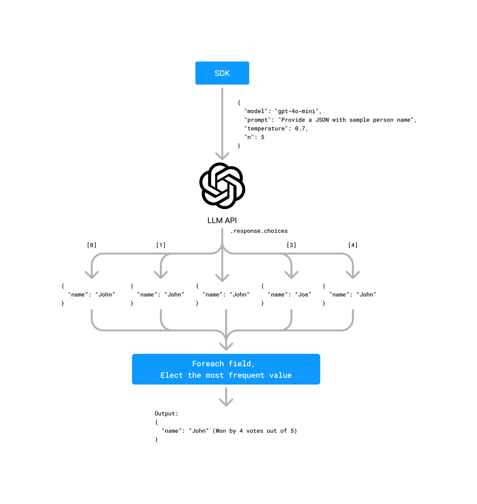

import LLMParallelProcessing from "@/components/LLMParallelProcessing";

Turning unstructured data into structured data is one of the core use cases for AI. In the OpenAI APIs world, the three most popular methods are:

- **JSON mode** - Instructing an LLM to output JSON. Instructions regarding the shape of the JSON must included in the prompt. This is also available in [Mistral models](https://docs.mistral.ai/capabilities/json_mode/).
- **Tool calling** - Instructing an LLM to call a tool that follows a certain JSONSchema. This functionality is also available in Anthropic's Claude models family.
- **Structured Outputs** - Evolution of JSON Mode with strict schema adherance. This mode while guaranteeing that the output will be a valid JSON adhering to the schema, comes with a cold-start cost of creating a grammar increasing latency for the first request.

You can learn more about their strengths and weaknesses in my [previous blogpost about benchmarking Strict Mode](/posts/benchmarking-llms-for-structured-json-generation/).

## Increasing Accuracy

### Enriching the Schema

Coming up with more detailed, less vague schema is your first line of defense in increasing the accuracy of the output. This includes:

- Providing `descriptions` for each field. Think of them as mini prompts for each field.
- Providing `reasoning` for fields that require deducing, decision making or computing a value based on other fields. Think of it as a mini ["Chain of Thought"](https://www.promptingguide.ai/techniques/cot) approach for each field. [Studies have shown](https://arxiv.org/abs/2201.11903) that providing reasoning can significantly improve the accuracy of the output. This technique leverages the LLM's ability to follow logical steps, making it particularly effective for complex fields that require inference or calculation. By guiding the model through the reasoning process, we can reduce errors and increase the reliability of the generated data.
- Not all JSONSchema are supported by the OpenAI's strict mode! Solution to this is: create as detailed schema as possible. Pass dumbed down version of the schema with only supported properties to the LLM (remove things like `min`, `oneOf`, `format`, `regex` etc). Validate the output against the full schema using e.g. Zod. Get the validation errors and pass them to the LLM along with the output and ask it to fix the errors. Repeat in the loop until the output is valid

**Cost:** Increased input tokens usage

### Fields Sequencing

In traditional computing, the order of fields in JSON does not matter but in LLM it does. Try to put them in as logical order as possible. For instance, when extracting data from invoice, bad order can be something like `"signed_by, invoice number, total, due date"` etc. If you were a human reading this invoice in that order, you would be very confused. LLM will have exactly the same trouble.

**Cost:** Free

### Multipass mode & election

This one is especiall useful in ambiguous cases and multimodal processing. Consider the following example from [`vidore/docvqa_test_subsampled` dataset](https://huggingface.co/datasets/vidore/docvqa_test_subsampled/viewer):


- What's the passenger's surname? Is it "Darby" or "Darry"?
- Is the conjunction ticket number `0015353-530004` or `0018353-530004`?
- Form of payment is `AGT-CK` or `HGT-GK`?

LLM might not be able to answer all of these questions with certainty. In such cases, you can use the `n` parameter, which allows for generating multiple completions in one request. This can be used to generate multiple JSONs in a single request and pay for the input just once (you will still be billed a multiple of `n` for the output tokens). This combined with bigger `temperature` which increases models creativity, can be used to ensemble a "mixture of results" approach.

Once you have multiple JSONs, for each field you can elect to take the most frequent value by using majority voting to decide on the value.



<details>
<summary>Example TS code for merging multiple JSONs</summary>

```typescript
import { ChatCompletion, ChatCompletionMessage } from "openai";

type JsonValue = string | number | boolean | null | JsonArray | JsonObject;
type JsonArray = JsonValue[];
type JsonObject = { [key: string]: JsonValue };

function getMostFrequentValue(values: JsonValue[]): JsonValue {
	const counts = new Map<string, { count: number; value: JsonValue }>();
	let maxCount = 0;
	let mostFrequent: JsonValue;

	for (const value of values) {
		const stringValue = JSON.stringify(value);
		const current = counts.get(stringValue) || { count: 0, value };
		current.count++;
		counts.set(stringValue, current);

		if (current.count > maxCount) {
			maxCount = current.count;
			mostFrequent = current.value;
		}
	}

	return mostFrequent!;
}

function mergeJsonValues(values: JsonValue[]): JsonValue {
	if (values.length === 0) return null;

	if (values.every((v) => Array.isArray(v))) {
		return mergeJsonArrays(values as JsonArray[]);
	}

	if (values.every((v) => typeof v === "object" && v !== null && !Array.isArray(v))) {
		return mergeJsonObjects(values as JsonObject[]);
	}

	return getMostFrequentValue(values);
}

function mergeJsonArrays(arrays: JsonArray[]): JsonArray {
	const maxLength = Math.max(...arrays.map((arr) => arr.length));
	const result: JsonArray = [];

	for (let i = 0; i < maxLength; i++) {
		const values = arrays.map((arr) => arr[i]).filter((v) => v !== undefined);
		result.push(mergeJsonValues(values));
	}

	return result;
}

function mergeJsonObjects(objects: JsonObject[]): JsonObject {
	const result: JsonObject = {};

	for (const key of new Set(objects.flatMap((obj) => Object.keys(obj)))) {
		const values = objects.map((obj) => obj[key]).filter((v) => v !== undefined);
		result[key] = mergeJsonValues(values);
	}

	return result;
}

function mergeChatCompletionChoices(completion: ChatCompletion): JsonValue {
	const parsedContents = completion.choices.map((choice) => {
		const message = choice.message as ChatCompletionMessage;
		return JSON.parse(message.content || "null");
	});

	return mergeJsonValues(parsedContents);
}

// Usage example
const mergedResult = mergeChatCompletionChoices(chatCompletionResponse);
console.log(mergedResult);
```

</details>

In models from other providers where you cannot use `n` parameter, you can still use the same approach by generating multiple completions. Keep in mind that the cost of such operation would be a multipled for both input and output tokens.

**Cost:** In OpenAI - multiplied output tokens usage. For other providers, multiplied output _and_ input tokens usage.

### Routing

When dealing with heterogeneous or unknown data, routing can significantly improve the accuracy and efficiency of JSON generation. This process typically involves two key steps:

1. **Classification**: First, use a general-purpose model to classify the input data into predefined categories. This step helps determine the nature of the data and which specialized model would be most appropriate for processing it.

2. **Specialized Schema Usage**: Once classified, route the data to a specialized prompt with a purpose-built schema for that data type. These specialized schemas are designed for particular data structures, allowing for more accurate and efficient JSON generation.

By implementing this routing approach, you can leverage the strengths of different models for various data types, ultimately leading to higher quality structured data output.


<details>
<summary>Example TS code for routing</summary>

```typescript
import { generateObject } from "ai";
import { openai } from "@ai-sdk/openai";
import { z } from "zod";

// Define the classification schema
const classificationSchema = z.object({
	documentType: z.enum(["invoice", "orderForm"]),
});

// Define the invoice schema
const invoiceSchema = z.object({
	invoiceNumber: z.string(),
	date: z.string(),
	totalAmount: z.number(),
	items: z.array(
		z.object({
			description: z.string(),
			quantity: z.number(),
			unitPrice: z.number(),
		}),
	),
});

// Define the order form schema
const orderFormSchema = z.object({
	orderNumber: z.string(),
	customerName: z.string(),
	products: z.array(
		z.object({
			productName: z.string(),
			quantity: z.number(),
		}),
	),
	shippingAddress: z.string(),
});

async function extractDocument(ocrText: string) {
	// Step 1: Classify the document
	const { object: classification } = await generateObject({
		model: openai("gpt-4"),
		schema: classificationSchema,
		prompt: `Classify the following OCR text as either an invoice or an order form:\n\n${ocrText}`,
	});

	// Step 2: Route to the appropriate schema based on classification
	if (classification.documentType === "invoice") {
		const { object: invoice } = await generateObject({
			model: openai("gpt-4"),
			schema: invoiceSchema,
			prompt: `Extract invoice information from the following OCR text:\n\n${ocrText}`,
		});
		return { type: "invoice", data: invoice };
	} else {
		const { object: orderForm } = await generateObject({
			model: openai("gpt-4"),
			schema: orderFormSchema,
			prompt: `Extract order form information from the following OCR text:\n\n${ocrText}`,
		});
		return { type: "orderForm", data: orderForm };
	}
}

// Usage example
const ocrText = `INVOICE
Invoice #: INV-2023-001
Date: 2023-05-15
Total Amount: $500.00

Items:
1. Widget A - Qty: 2, Price: $100.00
2. Widget B - Qty: 3, Price: $100.00`;

const result = await extractDocument(ocrText);
console.log(result);
```

</details>

## Increasing Speed

While the large part of use cases of turning unstructured data into structured data is async/not time-sensitive, there are still cases where speed is critical. Examples include an application that parses your resume in order to provide actionable insights or an application that parses your invoice in order to provide you with a summary of expenses.

### Parallel Processing

A trick commonly used in traditional computing is to use parallel processing to speed up the operation. This can be also used in LLM world. Split your schema into multiple independent schemas and generate multiple JSONs in parallel. Merge them afterwards.


Example code in Typescript using `ai` library:

```typescript
import { generateObject } from "ai";
import { openai } from "@ai-sdk/openai";
import { z } from "zod";

// Define the subschemas
const subSchemaOne = z.object({
	name: z.string(),
});
const subSchemaTwo = z.object({
	age: z.number(),
});

// Generate multiple JSONs in parallel
const responses = await Promise.all(
	[subSchemaOne, subSchemaTwo].map((subschema) => {
		const { object } = generateObject(subschema, {
			model: openai("gpt-4o"),
			schema: subschema,
			prompt: "John is 25 years old. What's his name or age?",
		});

		return object;
	}),
);

// Merge the responses into a single JSON object
const merged = responses.reduce((acc, curr) => ({ ...acc, ...curr }), {});
```

#### Caveats

Be careful though. As I mentioned before, sequence of fields and their co-presence does matter in LLM world. Make sure that your groups are independent logically and that they don't have any dependencies on each other. In practical example - if you have an invoice, you can split it into following independent subschemas: `Recipient`, `Sender`, `Items`.

Moreover, like classical computing, this is also a subject to [Amdahl's law](https://en.wikipedia.org/wiki/Amdahl%27s_law) or _the law of diminishing returns_ with slight twist:

<LLMParallelProcessing client:visible />

**Cost:** Multiplied input tokens usage.

## Reducing Costs

### Prompt Caching (also reduces latency)

In traditional LLM-based JSON generation pipelines, a common pattern emerges: the prompt structure and schema remain constant, while only the input data varies. This means that a significant portion of the prompt—often the largest part—remains unchanged across multiple requests. Prompt caching leverages this consistency to optimize performance and reduce costs.

This option **isn't** available in OpenAI APIs but it is available in Anthropic APIs and Google Gemini.

These two providers employ different approaches to prompt caching:

| Feature/Aspect            | Anthropic Prompt Caching                              | Google Gemini Context Cache                                                |
| ------------------------- | ----------------------------------------------------- | -------------------------------------------------------------------------- |
| Cost Reduction            | Up to 90%                                             | Halves the cost per prompt; $4.50 per million tokens per hour storage cost |
| Latency Reduction         | Up to 85%                                             | Improved efficiency; specific percentage not provided                      |
| Cache Lifetime            | 5 minutes                                             | 1 hour by default, adjustable                                              |
| Minimum Cachable Tokens   | 1024 tokens (Claude 3.5 Sonet & Claude 3 Opus)        | 32,000 tokens                                                              |
| Cache Writing Cost        | 25% more than base input token price                  | $1 per million tokens per hour (storage cost)                              |
| Use Case Suitability      | Suitable for short-term, small document caching       | Better for long-term, large document or codebase caching                   |
| Token Storage Flexibility | Smaller cache, shorter duration; good for quick tasks | Larger cache, adjustable duration; good for extended tasks                 |

### Cheaper & Smaller models

Another option is to use cheaper & smaller models. In order to maintain the accuracy, you need to invest in solid evaluation and validation process.

But this is not always the case. If running your own inference endpoints is an option, smaller OSS models like Microsoft's Phi-3 in conjunction with [Outlines](https://github.com/outlines-dev/outlines/) can even [beat much larger models](https://blog.dottxt.co/oss-v-gpt4.html) like GPT-4o.
